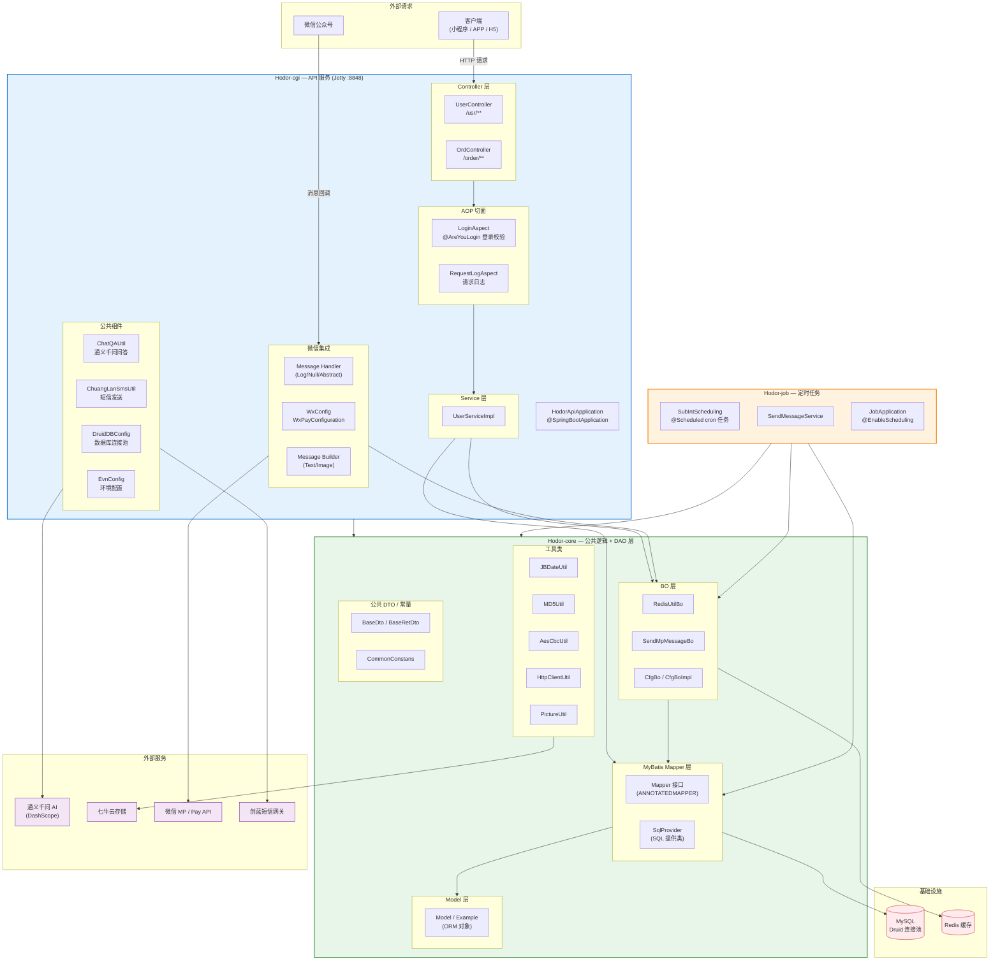
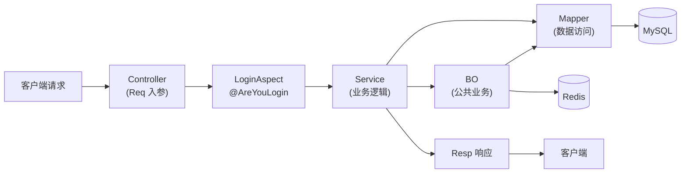

# Hodor 后端工程

## 项目概述

Hodor 是一个基于 Spring Boot 的多模块 Java 后端工程，使用 Gradle 构建。项目包含微信公众号/支付集成、MySQL 数据访问、Redis 缓存、七牛云存储、通义千问 AI 问答等能力。

- **Group**: `com.codido`
- **Version**: `1.0-SNAPSHOT`
- **Java**: 17
- **Spring Boot**: 2.7.18
- **Gradle**: 8.14.2

## 项目架构图



### 模块依赖关系

- `Hodor-cgi` → 依赖 `Hodor-core`
- `Hodor-job` → 依赖 `Hodor-core`
- `Hodor-core` → 独立，被其他两个模块引用

### 请求调用链路



## 构建与运行

```bash
# 构建整个项目
./gradlew build

# 运行 API 服务（Hodor-cgi，端口 8848）
./gradlew :Hodor-cgi:bootRun

# 运行定时任务（Hodor-job）
./gradlew :Hodor-job:bootRun

# 重新生成 MyBatis Mapper（在 Hodor-core 目录下）
./gradlew :Hodor-core:mybatisGenerate
```

## 技术栈

| 领域 | 技术 |
|------|------|
| 框架 | Spring Boot 2.7.18 |
| Web 容器 | Jetty（排除了 Tomcat） |
| 数据库 | MySQL + Druid 连接池 |
| ORM | MyBatis + MyBatis Generator + PageHelper 分页 |
| 缓存 | Redis (spring-boot-starter-data-redis) |
| 日志 | Logback |
| 接口文档 | Swagger (springfox 3.0.0) + swagger-bootstrap-ui |
| 微信 | weixin-java-mp 3.7.0, weixin-java-pay 3.7.0 |
| AI | 通义千问 (dashscope-sdk-java) |
| 云存储 | 七牛云 SDK |
| JSON | fastjson + gson |
| 工具 | Lombok, commons-lang3, httpclient |

## 代码规范与约定

### 分层架构

```
Controller → Service(Impl) → BO(Business Object) → Mapper → Model
```

- **Controller**: 对外 REST 接口，入参为 `req` 对象，返回 `resp` 对象
- **Service**: 业务逻辑处理，接口 + Impl 实现
- **BO**: 公共业务逻辑（如发微信推送、短信），跨 Service 复用
- **Mapper**: MyBatis 数据访问接口，由 MyBatis Generator 生成
- **Model**: 数据库表对应的 ORM 对象，由 MyBatis Generator 生成

### Bean 命名约定

| 后缀 | 用途 | 说明 |
|------|------|------|
| `Req` | Controller 入参 | 继承 `BaseReq`，含 Swagger 注解 |
| `Resp` | Controller 返回 | 继承 `BaseResp`，含 `respCode`/`respMsg` |
| `Dto` | Service/BO 层参数与返回值 | 业务逻辑处理 |
| `Vo` | 请求/响应中的业务对象 | JSON 序列化 |
| `Po` | 自定义 MyBatis 查询结果映射 | 对应自定义 SQL 结果集 |
| `Example` | MyBatis ORM 查询条件 | 自动生成，通常不修改 |
| `SqlProvider` | MyBatis SQL 提供类 | 自动生成，通常不修改 |

### 通用约定

- 所有请求对象继承 `BaseReq`（含 `tokenId`、`channelFlag`、`versionNumber`）
- 所有响应对象继承 `BaseResp`（含 `respCode`/`respMsg`，`0000` 表示成功）
- 使用 Lombok `@Data` 生成 getter/setter/toString
- 使用 Swagger 注解生成接口文档
- 登录校验通过自定义注解 `@AreYouLogin` + AOP `LoginAspect` 实现
- 包结构根包为 `com.codido.hodor.{module}.{domain}.{layer}`

## 配置文件

- 主配置: `application.yml` → 通过 `spring.profiles.active` 切换环境
- 环境配置: `application-dev.yml` / `application-uat.yml` / `application-ptc.yml`
- 日志配置: `logback-spring.xml`
- MyBatis Generator 配置: `Hodor-core/src/main/resources/tools/HodorGeneratorConfig.xml`

## 关键入口

- API 服务启动类: `Hodor-cgi/src/main/java/com/codido/hodor/api/HodorApiApplication.java`（端口 8848）
- 定时任务启动类: `Hodor-job/src/main/java/com/codido/hodor/job/JobApplication.java`
- Mapper 扫描路径: `com.codido.hodor.core.mapper`

## 注意事项

- `Hodor-core` 的 `bootJar` 已禁用，仅打普通 JAR 供其他模块依赖
- 项目使用 Jetty 而非 Tomcat 作为内嵌 Web 容器
- MyBatis Generator 使用 `ANNOTATEDMAPPER` 模式（注解 SQL，无 XML mapper 文件）
- 配置文件中的数据库地址、密钥等敏感信息为占位符，部署时需替换
